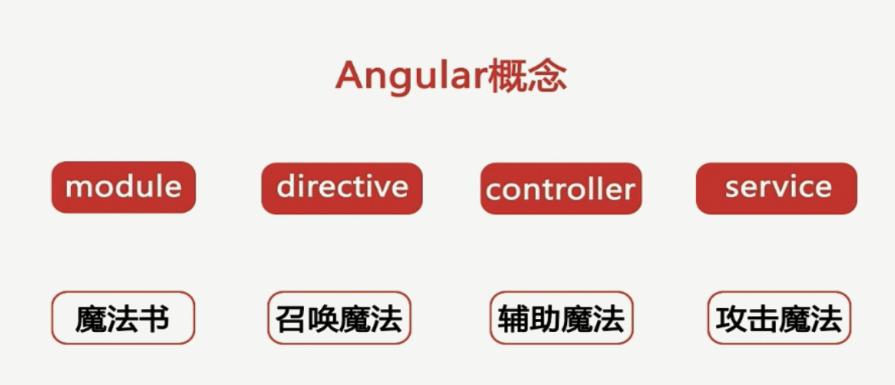

## angularjs-lagou

### angularjs概念

### 指令(directive)
 
 > 定义： 通过html标签，属性样式或注释使Angularjs编译器来为指定是DOM元素绑定特定的行为，甚至是改变DOM元素和它的子元素。
 > 内置指令：ng-model、ng-bind、ng-click、ng-class、ng-if、ng-hide、ng-show、ng-repeat……
 > 自定义指令常用的属性： 

 	- restrict： 调用方式 ( A:属性，E:元素，M:样式。C:注释)
 	- replace：替换（false：插入父元素内，true：替换父元素）
 	- scope：接口（`@`:代表可以直接接收字符串@abc， `=`: 可以接收变量 如$scope.list的list， `&`：事件 如ng-click）
 	- templateUrl：模板路径(html文件路径)
 	- template：模板 (html片段 和transclude配合使用、ng-transclude插入外部元素)
 	- transclude：内嵌html（true，false）
 	- lick：行为（function）

### 服务总结(service)

> 服务(service)和服务工厂(factory)

* 特点：单例，懒加载，公用函数
* 常用的服务：
	- $http (发出ajax)
	- $q (处理并发的请求`Promise`)
	- $timeout (延迟ms执行)
	- $interval (循环ms执行)
	- $rootScope (根作用域)
	
* 自定义服务——cache