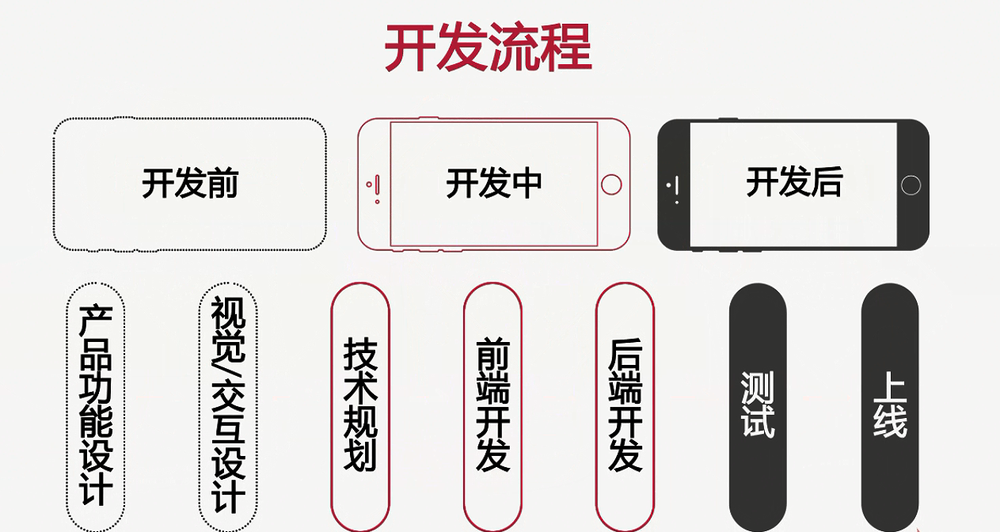
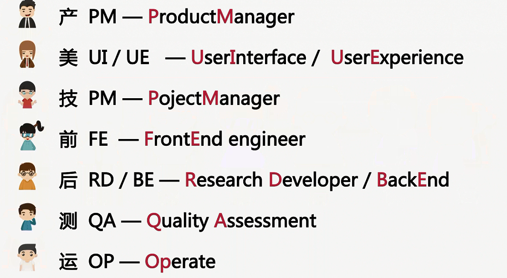
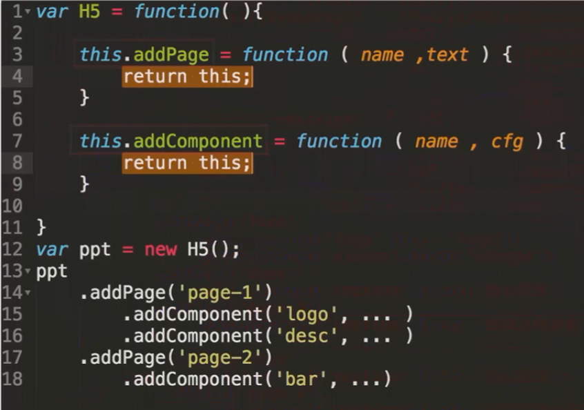

# H5专题总结报告

### 技术实现

* 技术规划、选型
* 设计易扩展的开发方案
* 开发各种图标组件

### 开发流程

* 每个流程要做什么
* 各环节容易出现的问题
* 问题定责

> 制定开发流程可以提升效率(知道什么时间找谁做什么事)

* 开发流程图

* 开发流程中对应的人员

### 项目需求

1、 首页载入动画  
2、 滑动切换页面  
3、 9个内容页：

  - 封面
  - 核心理念(图文)
  - 课程分布(折线图)
  - 移动课程(饼图)
  - 前端课程(柱图)
  - 后端课程(雷达图)
  - 报名过万(环图)
  - 难度分布(散点图)
  - 尾页

####  开发规划（产品经理）

 > 主要是项目开发文档.md

 1. 可行性确认
 2. 技术选型
 3. 开发/上线环境规划
 4. 技术开发方案设计
 5. 团队协作方式(git/svn)

> ……

#### 技术开发方案设计（技术经理）

一、页面DOM操作 

* 技术选型：JQuery
* 简介：一款轻量级JS框架
* 特点：(1) 强大的选择器  
		(2) 出色的 DOM 操作封装  
		(3) 可靠的事件处理机制 

二、页面切换功能  

* 技术选型：[`FullPage.js`](http://www.uedsc.com/fullpage.html)插件  
* 简介：JQuery插件  
* 特点：API简单、易用、跨浏览器 

三、组织内容结构方案：

* 页：Page
* 组件：Component
  	- 图文组件 
  	- 图表组件
* 技术点：（单纯用HTML+CSS或者Canvas都可以实现，但是更合理的方式是两者配和使用）
	- HTML+CSS 
		- 柱图/垂直柱图 
		- 散点图
	- Canvas 
		- 折线图 
		- 雷达图 
		- 饼图/环图

### 前端开发步骤

__一、设计稿标注&切图__

> 使用标注工具`MarkMain`及其使用方法

__二、编写静态页__

* 验证`fullPage.js`插件的页面切换功能
* 验证利用`fullPage.js`事件，实现组件的“入场，出场”动画

__三、开发测试__

“基本图文组件”类 ———— H5ComponentBase

作用： 输出一个DOM，内容可以使图片或者文字

功能：

1. 基本的图文组件(图、文设置)
2. 接收`onLoad`、`onLeave`事件
3. 开发方法：独立模块化开发
事件：

1. 当前页载入：onLoad  
2. 当前页移出：onLeave  

> 目的： 实现“出场，入场”动画提取

__四、开发测试__

“内容组织”类 ———— H5

功能：

1. 内容组织：添加页面，添加组件
2. 整合 `fullPage.js`支持页面切换
3. 链式调用：

作用：

1. 组织H5报告的内容结构  
2. 设置H5报告的切换效果(fullPage.js)    
    当页面切换时，通知页内所有的组件  

方法：

1. 添加一个页addPage  
2. 添加一个组件addComponent  
3. 展现所有页面loader  

> 目的： 实现内容页面与组件的组织功能，方便任意添加`page`，`component`内容

__五、 开发图表组件__

* H5ComponentBar
* H5ComponentPolyline
* H5ComponentRadar
* H5ComponentPie
* H5ComponentRing

作用：在H5ComponentDase的基础之上插入 DOM 结构或 Canvas 图形  

事件：  

1. 当前页载入移出：onLoad、onLeave  
2. 图表组件本身的生长动画  

__六、loading功能的开发__

__七、 功能整合__

  * 实现设计稿

