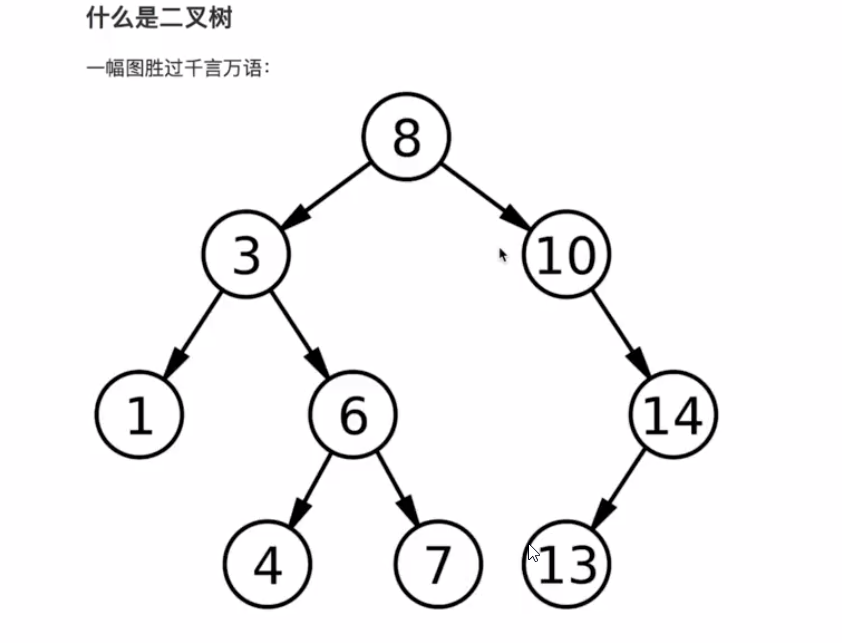

#  [排序二叉树](https://roy-lau.github.io/web_list/sort-two-fork-tree)

> 图释：

`8`：根节点 
`3` : 根节点的左孩子（小于父节点）
`10` : 根节点的右孩子（大于父节点）
`3`和`10`是兄弟节点

> 控制台查看:
1. [创建排序二叉树](https://roy-lau.github.io/web_list/sort-two-fork-tree/%E5%88%9B%E5%BB%BA%E6%8E%92%E5%BA%8F%E4%BA%8C%E5%8F%89%E6%A0%91.html)
2. [中序遍历二叉树](https://roy-lau.github.io/web_list/sort-two-fork-tree/%E4%B8%AD%E5%BA%8F%E9%81%8D%E5%8E%86%E4%BA%8C%E5%8F%89%E6%A0%91.html)
3. [前序遍历二叉树](https://roy-lau.github.io/web_list/sort-two-fork-tree/%E5%89%8D%E5%BA%8F%E9%81%8D%E5%8E%86%E4%BA%8C%E5%8F%89%E6%A0%91.html)
4. [后序遍历二叉树](https://roy-lau.github.io/web_list/sort-two-fork-tree/%E5%90%8E%E5%BA%8F%E9%81%8D%E5%8E%86%E4%BA%8C%E5%8F%89%E6%A0%91.html)
